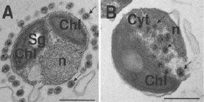

# 最小化细胞

当我们想到生命时，数以百万计的例子涌入我们的脑海：从大型的多细胞生物，如大象、树木和鲸鱼到单细胞生物如细菌、藻类到酵母。
以上例子都具有一些共性：都包含DNA程式，都包含RNA与蛋白质工具，且都被脂质生物膜所包被而形成细胞。比所有细胞都要小的是病毒，它们含有DNA与RNA其中之一和蛋白质。
病毒通过感染和改写细胞程式进行生命活动，并且无法独立繁殖。因此病毒，以及转座子与质粒，都不被视作独立生命体，因此，一般地它们不能算作生命，而是一种异常的遗传程式。

所有独立生命体都由细胞组成这一观点被这样一个强有力的证据所支持——所有自然界中我们视作生命的物体都至少包含一个细胞。
将DNA、RNA与蛋白质隔离分区似乎是生命的基本属性，且是演化过程的不可或缺的要求。但是，构成一个细胞需要多少组件，以及最小化的，可以独立生存的细胞是什么呢？

## 天然最小细胞

合成生物学与生物技术中使用的典型细胞底盘（宿主生物）是*E.coli*（大肠杆菌）与*S.cerevisiae*（酵母菌）
。两者均为单细胞微生物，但在尺寸上相差较大。原核生物*E.coli*直径约为1微米，基因组DNA包含460万碱基对，编码约4500个基因。
即使最简单的真核生物之一——*S.cerevisiae*与大多数细菌相比都要大得多，也复杂得多。
其直径约为10微米，基因组DNA具有1250万碱基对，编码约5800个基因。有趣的是，即使酵母菌比*E.coli*的DNA多三倍，且体积是后者的100到1000倍，它仅比后者多约1000个基因。
这是否意味着我们可以期望所有微生物都拥有一基准数量的基因？为了回答这一问题，研究人员考察了微生物的多样性，以寻找DNA比*E.coli*与酵母菌小得多的，独立存活的细胞。
通过学习这些自然界中的例子及计数其基因组所编码的基因数量，研究人员开始了解生命的最低限度，即实现独立细胞的自然功能究竟需要多少基因。
最小的真核生物细胞拥有约1200万碱基对DNA，和5000个基因。酵母菌*S.cerevisiae*是其中之一，尽管其近亲，酵母菌*S.pombe*（裂殖酵母）具有略小的基因组。
与前者相比，几种营寄生真核生物的基因组则小得多，但与病毒类似，它们依赖于其宿主故不具有独立细胞所必需的基因。最小真核生物的一个有趣的例子是*Ostreocuccus tauri*（金牛鸵球藻），已知最小独立生存的光合真核生物（图 4.1）。
这种原始藻类的细胞与*E.coli*同样大，但具有叶绿体与淀粉粒等在更大型的植物细胞中常见的细胞器。其基因组拥有1250万碱基对的DNA，但其所拥有的基因多大8000个。*O.tauri*是具有较小细胞而基因数量较大的一个例子。

> 图4.1 *O.tauri*细胞的电子显微镜图像。细胞器标注为Chl（叶绿体），Sg(淀粉粒），n（细胞核）
> 与Cyt（细胞质）。（引自：E.Derelle et al. 2008. PLoS ONE 3(5):e2250.）
